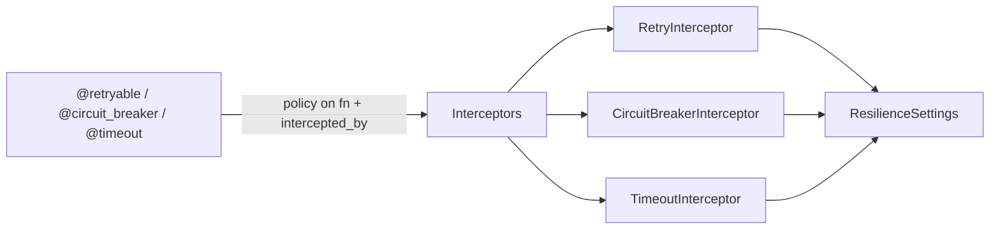

# Architecture

| Module | Responsibility |
|---|---|
| `decorators.py` | Store the policy on the function; attach the interceptor |
| `interceptors.py` | Execute the policies (sync + async paths) |
| `config.py` | `ResilienceSettings` (`enabled` switch) |
| `exceptions.py` | `RetryExhaustedError`, `CircuitOpenError` |

## Design decisions

**Policy on the function, logic in the interceptor.** Decorators are
import-light markers (the pico-pydantic idiom); the interceptors are
container singletons with settings injected. Testable, and the policy is
introspectable on the class.

**`@retryable` runs innermost.** Retry attempts after the first re-invoke
the method directly. Rather than re-dispatching the whole chain per attempt
(complex, surprising side effects), the rule is documented and enforced by
convention: `@retryable` on top, other policies wrap the loop. A regression
test pins this behavior.

**`@timeout` is async-only, rejected at decoration time.** Python threads
cannot be cancelled: a sync timeout would return control while the work keeps
running — a lie plus a leak. Failing at import beats failing in production.

**Circuit state per method, in the singleton.** Keyed by
`module.Class.method`, one lock. Two instances of a component share the
circuit — the protected resource is the dependency, not the instance.

**Half-open allows exactly one trial.** On entry the failure counter is set
to `threshold - 1`: a single failure reopens, a success resets. No separate
state enum to keep in sync.
